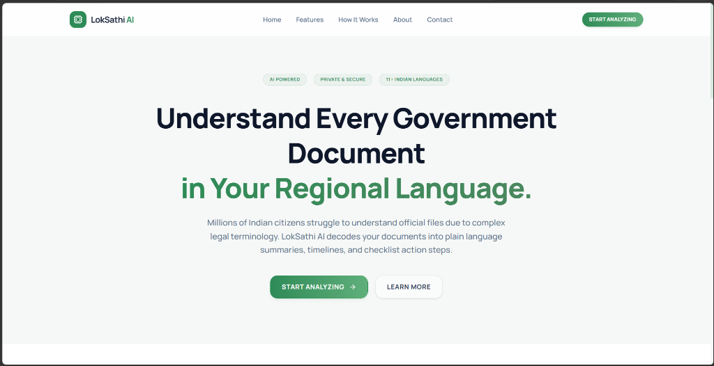
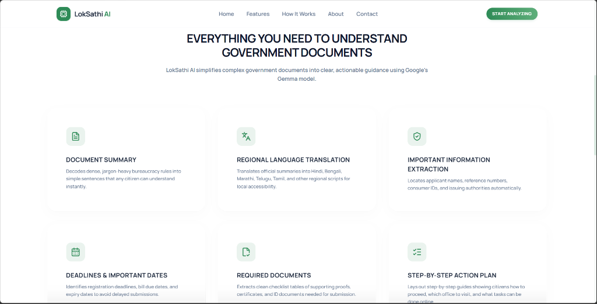
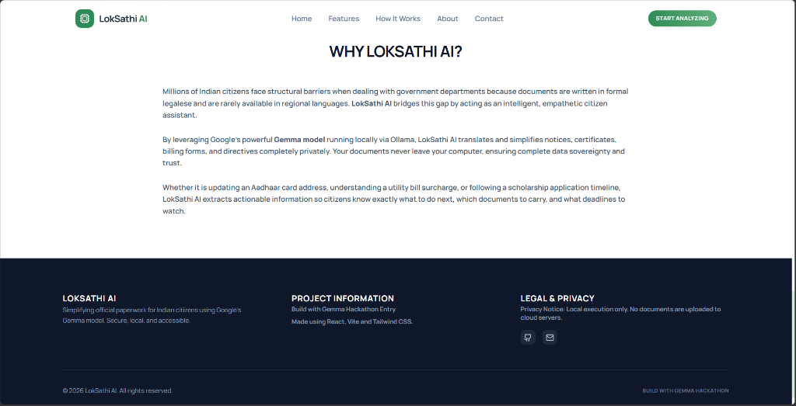
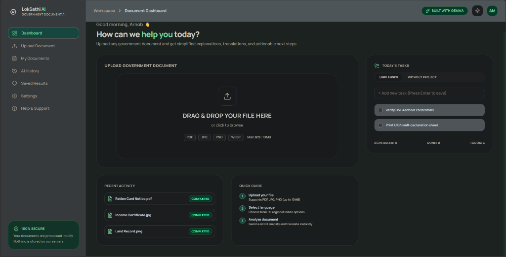
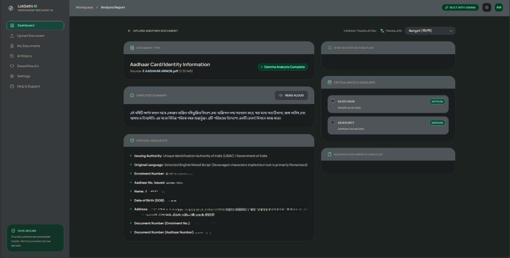

# 🇮🇳 LokSathi AI - Multilingual Government Document Assistant

LokSathi AI is a premium, 100% offline government document assistant powered by Google's Gemma model. It simplifies complex banking, healthcare, education, legal, and civic documents into clear plain-language summaries, action checklists, timelines, and translation sets in major Indian regional languages—all processed locally on your machine for complete data privacy.

---

## 📸 App Screenshots

### 🌐 Landing Page
*Welcome screen, feature grid, and system details with full responsiveness and clean layouts.*

| Hero Section | Feature Highlights |
| :---: | :---: |
|  |  |

| Platform Mission & Details |
| :---: |
|  |

### 🖥️ Dashboard & File Upload
*Local document upload interface supporting PDF, JPG, PNG, and WebP, with real-time task manager and status indicators.*



### 📊 Document Analysis Report
*AI-generated summaries, extracted highlights, checklists, dates, and localized translations (e.g., Bengali translation shown below).*



---

## ✨ Features
- **100% Offline Privacy**: Intercepts documents locally; no data ever leaves your computer.
- **Selectable PDF Text Extraction**: Extracts text layers instantly.
- **Scanned Document OCR Pipeline**: Automatically detects scanned/image documents and uses Gemma Vision to transcribe content verbatim.
- **Dual-Pass AI Processing**:
  - **Pass 1 (Classifier)**: Detects document type, primary language, and transcribes text verbatim.
  - **Pass 2 (Analyzer)**: Performs semantic reasoning to extract timeline dates, fees, required lists, warnings, and translations.
- **Today's Tasks Manager**: An interactive checklist automatically generated from document requirements.
- **Multilingual Support**: Supports English, Hindi, Bengali, Marathi, Telugu, Tamil, Gujarati, and other regional scripts.

---

## 🛠️ Prerequisites
Before running the application, make sure you have the following installed:
1. **Node.js** (v18 or higher recommended)
2. **Ollama** (v0.1.30 or higher) for running LLMs locally

---

## 🚀 Setup & Installation

### Step 1: Install Ollama
1. Download Ollama from the official website: [ollama.com](https://ollama.com).
2. Install it on your operating system (available for Windows, macOS, and Linux).
3. Ensure the Ollama daemon is running in the background (you will see the Ollama icon in your system tray).

### Step 2: Download the Gemma Model
For full document classification and scanned image OCR support, download a multimodal-enabled local model. Run the following command in your terminal:

```bash
ollama pull gemma4:e2b
```
*(Alternatively, you can target standard models like `gemma:2b` or `gemma2:9b` via the application Settings panel).*

### Step 3: Clone the Repository & Install Node Dependencies
Open a terminal in the root of the project directory and install the project libraries:

```bash
# Install NPM dependencies
npm install
```

### Step 4: Run the Development Server
Launch the local dev server using:

```bash
npm run dev
```

The application will run on your local network (e.g., `http://localhost:5173/`). Open this URL in any modern browser to begin.

---

## ⚙️ How it Works
1. **Proxy Target Configuration**:
   The development server utilizes Vite's configuration to proxy request endpoints from `/ollama` directly to your local daemon at `http://127.0.0.1:11434`.
2. **Modular Architecture**:
   - `src/services/ollamaClient.js`: Consolidates fetch payloads.
   - `src/services/imageProcessor.js` & `src/services/pdfProcessor.js`: Pre-process files.
   - `src/services/documentClassifier.js` & `src/services/documentAnalyzer.js`: Coordinate the dual passes.
   - `src/services/analysisPipeline.js`: Coordinates the orchestrations.

---

## 📄 License
This project is built for the Gemma Hackathon and is open source.
